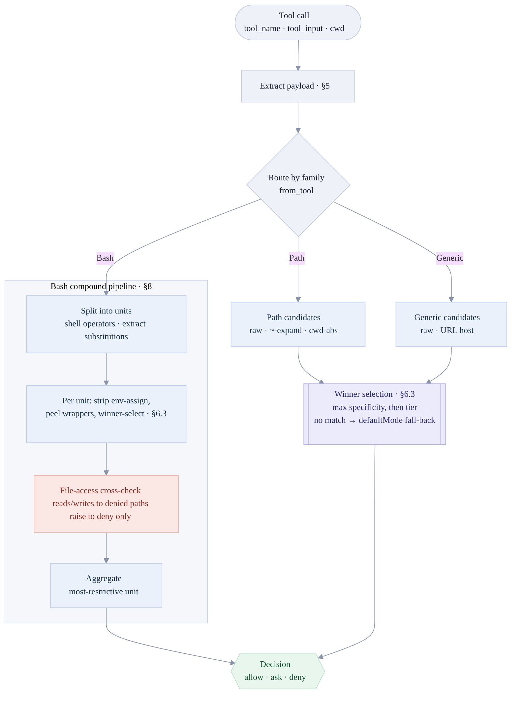

# Design: permcheck

Technical design companion to `specs/SPEC.md`. The spec is the behavioral source
of truth; this document explains **how** the implementation realizes it. Where
this document and the spec disagree, the spec wins. Section references (§) point
into `specs/SPEC.md`.

## 1. Shape of the system

permcheck is one Cargo package (`permcheck`, edition 2024) exposing a **library**
plus a **binary** of the same name. All engine logic lives in the library; the
binary is a thin shell that handles I/O and mode dispatch (§2, §12).

```
stdin JSON / CLI args
        │
   src/main.rs         parse args, pick mode, read payload, fail-closed wrapper
        │  evaluate(&RuleSet, tool, &tool_input, cwd)
        ▼
   src/lib.rs          extract payload (§5), route by Family
        │
   ┌────┴─────────────────────────────┐
   ▼                                   ▼
 bash.rs (Bash family, §8)     engine.rs (Path/Generic, §6.3, §7)
   │  decompose → per-unit           │  candidate forms → winner selection
   ▼                                  ▼
 matcher.rs  ← compiled patterns + specificity (§6.1, §6.5)
 rules.rs    ← grammar, load, RuleSet index (§3, §4)
 types.rs    ← Tier, Decision, Family, extract_payload (§5, §6.2)
        │
        ▼
   Decision {tier, reason}  → hook JSON (always exit 0) or CLI exit code
```

That map is the module wiring. The **decision flow** — how one call routes
through those modules to a verdict — is:



Path and Generic run winner selection (§6.3) once; Bash runs it per unit inside
the compound pipeline (§8), where the cross-check can only raise a unit to
`deny`. Every lane ends at the same three-way decision.

Only two runtime dependencies: `serde` / `serde_json`. **No `regex`, no `clap`**
— see §7 below.

## 2. Core types (`src/types.rs`)

- **`Tier { Allow, Ask, Deny }`** — the decision lattice, declared in that order
  and deriving `Ord`, so "most restrictive wins" is just `max` (§6.2). `label()`
  gives the lowercase string used in both the hook JSON and the reason.
- **`Decision { tier, reason }`** — the engine's output. `from_tier(tier,
  payload)` builds the uniform `"<label>: <payload>"` reason (§2.1);
  `deny_msg(msg)` builds a fail-closed `deny` carrying a descriptive reason
  instead. `to_hook_json` / `to_hook_json_pretty` serialize the PreToolUse output
  object; `to_exit_code` maps `Allow/Ask/Deny → 0/1/2`.
- **`Family { Bash, Path, Generic }`** with `from_tool(tool)` — the routing
  decision (§5). `extract_payload(tool, &input)` pulls the string to match out of
  `tool_input`, per the taxonomy table (§5): `Bash→command`, path tools→
  `file_path`/`notebook_path`/`path`, `WebFetch→url`, `WebSearch→query`,
  `SlashCommand→command`, otherwise the first non-empty string field.

## 3. Rules: grammar, loading, indexing (`src/rules.rs`)

A rule is one string: a **bare rule** (`Tool`, matches any payload for that tool)
or a **specifier rule** (`Tool(specifier)`) (§4). Tool names match
`[A-Za-z][A-Za-z0-9_]*`, covering built-ins and MCP `mcp__server__tool` names.

- `LoadError` enumerates every way a rule file can be rejected (unreadable, not
  JSON, no permissions object, empty specifier `Tool()`, uncompilable specifier,
  …). **Bad rules fail at load, never at decision time** (§4, §9.1) — there is no
  evaluation-path code that can panic on runtime input.
- Both accepted file shapes — `{ "permissions": {…} }` and a bare
  `{ "allow": […], … }` — parse identically. `defaultMode` sets the no-match
  fall-back tier (`ask`/`deny`); other unknown keys are ignored so the file can
  double as a Claude Code settings file (§3.1).
- `CompiledRule { tool, matcher, specificity, tier, order_index }` is the
  compiled form. `RuleSet` holds all rules plus a `HashMap<tool, Vec<idx>>` index
  so `rules_for(tool)` is a hash lookup, not a scan. `order_index` preserves file
  order for deterministic tie-breaks (§6.3).

## 4. Matchers and specificity (`src/matcher.rs`)

`Matcher { Bare, Bash, Path, Generic }`; `compile(family, specifier) -> (Matcher,
specificity)`. Specificity (§6.1) is:

```
specificity = (literal, non-wildcard chars in the specifier)
            + (EXACT_MATCH_BONUS = 1000 if there is no wildcard at all)
```

A bare rule scores `0`. The +1000 bonus guarantees any exact specifier outranks
any wildcard specifier regardless of length.

Per-family semantics (§6.5):

- **Bash** — anchored full-string pattern over the trimmed command. The trailing
  form `cmd:*` matches `cmd` alone or `cmd <args>`; `*` elsewhere spans any run
  of characters; everything else is literal.
- **Path** — a glob over the file path. `*` spans non-`/` runs, `?` one non-`/`
  char, `**` crosses separators; leading `//` is a root marker, leading `~`/`~/`
  expands via `$HOME`; `[ ] { } \` are **literal**, not metacharacters.
- **Generic** — a domain/URL pattern. An optional `domain:` prefix is stripped;
  `*` is the only wildcard and spans everything including `/`; every other char
  (`.`, `?`, `&`, `:`) is literal, and matching is anchored so `example.com`
  never matches `example.com.evil.com`.

All three share a backtracking `glob_match`.

## 5. Winner selection and candidate forms (`src/engine.rs`)

For a single payload, `decide_unit` gathers **every** matching rule (including a
bare rule at specificity 0), each contributing `(specificity, tier)`, and picks
the maximum compared lexicographically (§6.3):

1. higher **specificity** wins;
2. on a tie, higher **tier** wins (`deny > ask > allow` — most-restrictive);
3. on a full tie, the lowest `order_index` (first in file) wins — deterministic.

If nothing matches, the decision is the rule set's **`defaultMode` fall-back** —
`ask` when `defaultMode: "ask"`, otherwise `deny` (§6.4). The cross-check and
error paths still deny regardless.

To match regardless of how the payload was written, the engine builds
**candidate forms** and a hit on any counts (§7.1): Path uses the raw payload,
its `~`-expanded form, and its `cwd`-absolutized form (so a bare `.env` matches a
rule written absolutely); Generic uses the raw payload plus the host extracted
from a `scheme://host/…` URL (and a lowercased host). `$HOME` is resolved once
via a `OnceLock`.

This single pass is the **entire** decision for Path and Generic tools. Only Bash
adds a step.

## 6. Compound-Bash pipeline (`src/bash.rs`)

`decide_bash(command, &RuleSet, cwd)` implements §8:

1. **Split** into units on shell operators outside quotes (`&&`, `||`, `|`, `;`,
   `&`, newlines), pulling inner commands out of `$(…)`, backticks, and process
   substitutions `<(…)` / `>(…)`. The splitter is **total**: it never errors, and
   unterminated constructs are consumed to end of input.
2. **Per unit**, strip leading `NAME=value` env assignments, then run §6.3
   selection on the trimmed unit.
3. **File-access cross-check** (raises to `deny` only — never loosens): tokenize
   the unit, peel wrappers (`sudo`, `env`, `timeout`, `nice`, …), then check
   reader operands (`cat`, `grep`, …) against `Read` deny rules, writer operands
   (`tee`, `dd`, …) against `Write`/`Edit` deny rules, and redirection targets
   (`<`, `>`, `>>`, `&>`) against the matching deny rules. Pure fd dups like
   `2>&1` are skipped. This catches `cat .env` even though `Bash(cat:*)` is
   allowed.
4. **Aggregate**: the command's verdict is the most restrictive unit verdict; the
   reason echoes the whole command.

`tokenize` (producing `Token` / `RedirectKind`), `split` (producing `Unit`),
`strip_env_assignments`, and the reader/writer/wrapper tables all live here.

## 7. Load-bearing choices

- **`panic = "unwind"`** (release profile). Hook mode wraps evaluation in
  `catch_unwind` and turns any panic into `deny` (§9.1). `panic = "abort"` would
  make that fail-closed guarantee impossible — this is a policy choice, not a
  style one.
- **No `regex`, no `clap`.** The binary is a fresh short-lived process per tool
  call, so cold-start cost dominates. Hand-written globs (§6.5) cost microseconds
  cold; compiling a regex set costs milliseconds with nothing to amortize.
  Argument parsing (§2) is likewise hand-rolled. Rationale and numbers:
  `benches/BENCHMARKS.md`.
- **Fail-closed everywhere.** Every fallible load step returns a `Result`;
  invalid rules fail at load. The evaluation path has no runtime-input panic. The
  hook always exits 0, carrying the decision in JSON.

## 8. The binary (`src/main.rs`)

`main` installs a silent panic hook, parses args, and dispatches:

- **`run_hook`** — reads the PreToolUse event JSON from stdin, loads rules,
  evaluates inside `catch_unwind`, prints the decision object, **always exits 0**.
  Any failure becomes `deny`.
- **`run_cli`** — `permcheck <Tool> [payload] --rules <path> [--json]`. Builds a
  minimal `tool_input` for the payload, evaluates, and exits `0/1/2` by tier or
  `3` on a config/usage error. `--json` prints the same object as hook mode.
- Helpers: `display_reason`, `print_help` (NO_COLOR-aware ANSI), `find_rules_arg`,
  `build_tool_input`.

## 9. Module map

| File | Responsibility | Spec |
|---|---|---|
| `src/lib.rs` | crate root; `evaluate()`, `load_rules*`, re-exports | §12.3 |
| `src/types.rs` | `Tier`, `Decision`, `Family`, `extract_payload` | §5, §6.2 |
| `src/rules.rs` | grammar, `LoadError`, `CompiledRule`, `RuleSet`, load | §3, §4 |
| `src/matcher.rs` | `Matcher` + Bash/Path/Generic matchers, specificity | §6.1, §6.5 |
| `src/bash.rs` | tokenizer, splitter, file-access cross-check | §8 |
| `src/engine.rs` | winner selection + candidate forms | §6.3, §7 |
| `src/main.rs` | arg parsing, hook/CLI dispatch, help | §2 |

Testing and build layout are in `specs/SPEC.md` §12.4.
